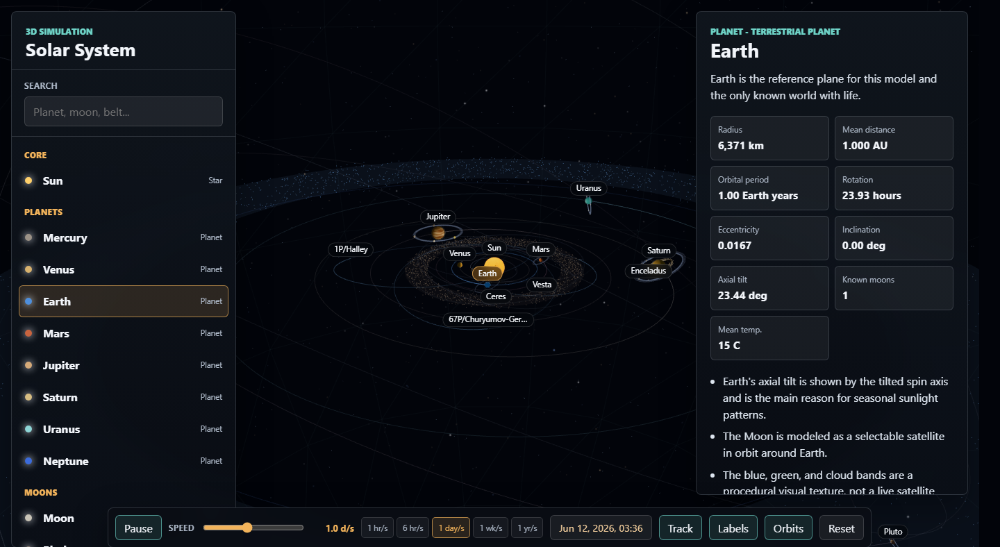
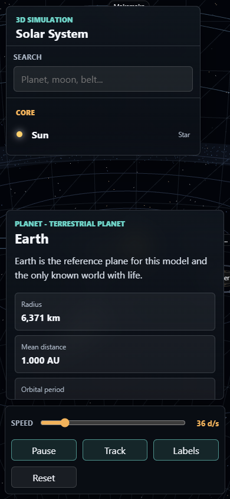

# 3D Solar System Simulation

An interactive Windows 11-friendly Three.js simulation of the solar system. It includes the Sun, eight planets, five officially recognized dwarf planets, 24 selectable moons, three large main-belt asteroids (Vesta, Pallas, Hygiea), ring systems, the main asteroid belt, the Kuiper Belt, the Oort Cloud, and three comets (1P/Halley, 2P/Encke, 67P/Churyumov-Gerasimenko).

The app is designed as a local static browser experience: no build step, no npm install, and no internet connection required after cloning because Three.js is vendored in `vendor/`.



## Features

- Interactive 3D scene with orbit controls, zoom, pan, object labels, and a simulation clock.
- Selectable bodies and regions with explanations, source links, and physical/orbital stats.
- Elliptical planet, dwarf planet, asteroid, and comet orbits using semimajor axis, eccentricity, inclination, and sidereal period metadata.
- Tilted planetary spin axes, visible ring systems, and expanded moon systems for major satellites.
- Searchable object list covering 54 selectable items, including small moons of Pluto, Eris, Haumea, and Makemake.
- Detailed procedural textures with recognizable landmarks: Earth's continents and rotating cloud deck, Jupiter's Great Red Spot, Mars's Valles Marineris and Tharsis volcanoes, Pluto's heart, Iapetus's two-tone surface, Enceladus's tiger stripes, and more.
- Bump-mapped cratered terrain, atmospheric rim glow on worlds with significant atmospheres, and lumpy irregular meshes for small moons, asteroids, and comet nuclei.
- Saturn's rings with the Cassini Division, Encke gap, and F ring, plus distinct ring styles for Jupiter, Uranus, Neptune, and Haumea.
- Tumbling 3D debris fields in the asteroid belt and Kuiper Belt, a Milky Way band in the starfield, and a pulsing solar corona.
- Comets with distance-dependent activity: separate ion and dust tails that grow near perihelion, always point away from the Sun, and fade in the outer system.
- Logarithmic speed slider from about 30 simulated minutes per second up to years per second, with one-click presets (1 hr/s to 1 yr/s). The default pace is 7 days per second.
- Responsive layout verified at desktop and mobile-sized viewports.

## Run on Windows 11

Double-click `Start-SolarSystem.cmd`.

Or run this from PowerShell:

```powershell
.\Start-SolarSystem.ps1
```

The launcher starts a local server on `http://127.0.0.1:8765/` or the next open port, opens your default browser, and serves the app from this folder. Press `Ctrl+C` in the terminal to stop the server.

## Run from Any Local Web Server

Because the app uses JavaScript modules, open it through a local web server rather than by double-clicking `index.html`.

Example with Python:

```powershell
python -m http.server 8765 --bind 127.0.0.1
```

Then open:

```text
http://127.0.0.1:8765/
```

## Controls

- Object list: choose any body, moon, comet, or region.
- Search: filter selectable objects.
- Pause/Play: stop or resume the simulation clock.
- Speed: logarithmic slider for simulated time per real second, plus preset buttons (1 hr/s, 1 day/s, 1 wk/s, 1 mo/s, 1 yr/s). At speeds below 3 days per second the date chip also shows the simulated time of day.
- Track: keep the camera target on the selected object.
- Labels: show or hide scene labels.
- Reset: return to the default date and camera view.
- Mouse/touch: drag to orbit, scroll/pinch to zoom, and pan with standard browser gestures.

## Scientific Scope

The simulation data was reviewed in June 2026. It uses real-world orbital and physical metadata where practical:

- Radius
- Semimajor axis
- Eccentricity
- Inclination
- Sidereal orbital period
- Rotation period and retrograde direction where applicable
- Axial tilt where known
- Current moon counts
- Major ring systems

The rendered scene uses visual compression. True solar-system distances and true body sizes cannot both be shown in a practical interactive view because the Sun, planets, moons, dwarf planets, and outer reservoirs differ by many orders of magnitude. The details panel preserves real values while the 3D scene keeps objects visible and selectable.

## Current Moon Counts

- Mercury: 0
- Venus: 0
- Earth: 1
- Mars: 2
- Jupiter: 101 IAU-recognized moons, following NASA's April 2026 Jupiter moon page and the IAU/MPC March 2026 announcement.
- Saturn: 285 known moons, following the IAU/MPC March 2026 announcement. NASA's Saturn moon page still describes the March 2025 count of 274.
- Uranus: 29 known moons, following NASA's August 2025 Webb discovery report for S/2025 U1.
- Neptune: 16 known moons, following NASA.

## Project Structure

```text
.
├── index.html                 # App shell and import map
├── styles.css                 # Responsive interface styling
├── Start-SolarSystem.cmd      # Double-click Windows launcher
├── Start-SolarSystem.ps1      # PowerShell local server
├── js/
│   ├── main.js                # Three.js rendering, animation, selection, UI wiring
│   ├── textures.js            # Procedural texture painters, ring/glow textures
│   └── solarData.js           # Solar-system data, descriptions, and source metadata
├── vendor/
│   ├── three.module.js        # Vendored Three.js 0.184.0 module
│   ├── three.core.js          # Three.js core module dependency
│   ├── OrbitControls.js       # Three.js orbit controls
│   └── THREE-LICENSE.txt      # Three.js MIT license
├── qa-desktop.png             # Desktop QA screenshot
└── qa-mobile.png              # Mobile viewport QA screenshot
```

## Validation

The app was checked locally before publication:

- JavaScript syntax checks passed for `js/main.js` and `js/solarData.js`.
- `Start-SolarSystem.ps1` parsed successfully.
- The app served successfully from `http://127.0.0.1:8765/`.
- Chrome/Playwright QA passed at desktop and mobile viewport sizes.
- WebGL canvas rendered nonblank pixels in automated sampling.
- Object selection updated the details panel, including S/2025 U1.
- No desktop or mobile browser console errors were reported.
- No horizontal overflow or panel overlap was detected in QA.



## Primary Sources

- NASA Solar System Exploration: https://science.nasa.gov/solar-system/
- NASA About the Planets: https://science.nasa.gov/solar-system/planets/
- NASA GSFC NSSDCA Planetary Fact Sheets: https://science.gsfc.nasa.gov/solarsystem/dataarchives/projects/629/
- NASA Jupiter Moons: https://science.nasa.gov/jupiter/jupiter-moons/
- IAU/MPC March 2026 moon announcement: https://www.iau.org/IAU/IAU/News/Ann2026/MPC-New-Moons-Saturn-Jupiter.aspx
- NASA Saturn Moons: https://science.nasa.gov/saturn/moons/
- NASA Uranus Moons: https://science.nasa.gov/uranus/moons/
- NASA Webb discovery of Uranus moon S/2025 U1: https://science.nasa.gov/blogs/webb/2025/08/19/new-moon-discovered-orbiting-uranus-using-nasas-webb-telescope/
- NASA Neptune Moons: https://science.nasa.gov/neptune/moons/
- NASA Kuiper Belt: https://science.nasa.gov/solar-system/kuiper-belt/
- NASA Oort Cloud: https://science.nasa.gov/solar-system/oort-cloud/
- NASA 1P/Halley: https://science.nasa.gov/solar-system/comets/1p-halley/

## Notes

This is an educational simulation, not a precision ephemeris. Orbital periods, relative ordering, eccentricities, inclinations, and science metadata are grounded in current references, while rendered sizes, distances, moon orbit radii, the Oort Cloud, and visual textures are intentionally adjusted for legibility and interaction.
